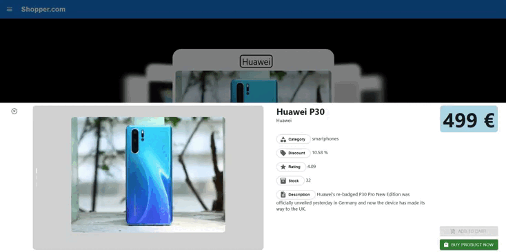

    <h1><b>SHOPPER.COM</b></h1>
    

<h2>beta v 0.1</h2>

Проект создан на платформе <code>Next.js</code>. Приложение взаимодействует с внешникми асинхронныем данными с <code>JSON api</code>.
Так же присутствует авторизация по логин/пароль

<h2>Данные для авторизации:</h2>    
    <ul>
        <li>login - <code>kminchelle</code></li>
        <li>password -  <code>0lelplR</code></li>
    </ul>

    
    
    
    
    
    
    
    
    

